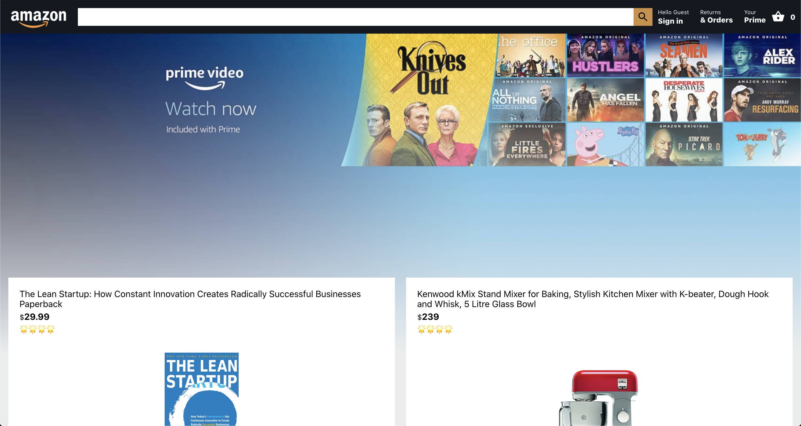
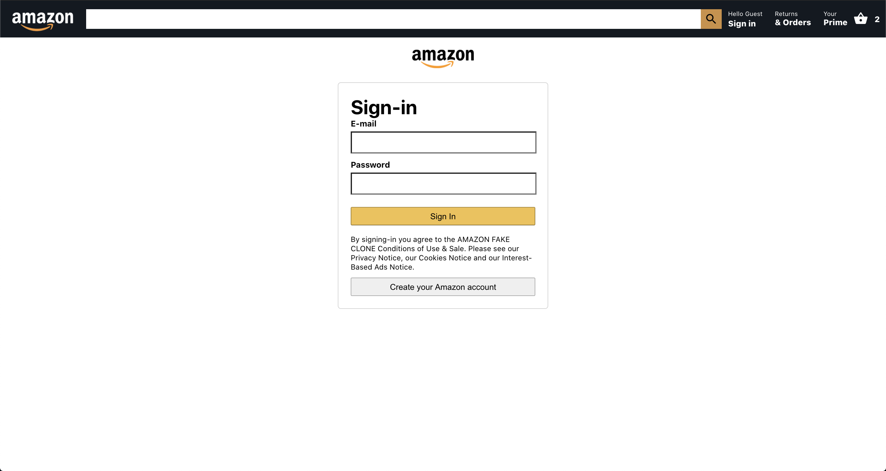
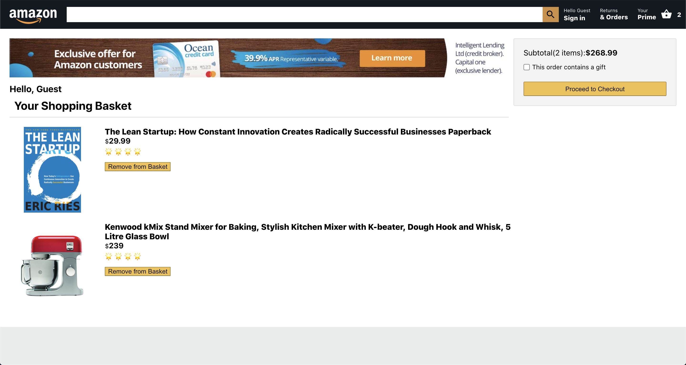

# About

This is a Amazone clone with some front-end features. You can add items to a cart and it also has full user authentication. 

# Technologies

The technologies used to build this website include:

- HTML5
- CSS3
- REACT
- REACT - ROUTER - DOM
- REACT-CONTEXT-API

# More info

This website includes 3 main pages:

1. Home
2. Cart
3. Login

### Home

The homepage features a product page resembling that of Amazon. It includes 5 products that can be selected and added to the cart. 

### Login

Use the sample credentials below to test out the login feature or make your own account.

username: test@gmail.com
password: test123

The clone includes an authentication page which allows users to create accounts and login. The Amazon header shows whether you are logged in or not by featuring your email. Authentication is handled through  [Google Firebase](https://firebase.google.com/docs/auth)

### Cart

The cart section shows which items you have selected for checkout. It shows the subtotal cost of all your items and allows for the removal of items. 

# Website Images

Homepage:

Login:

Cart:

